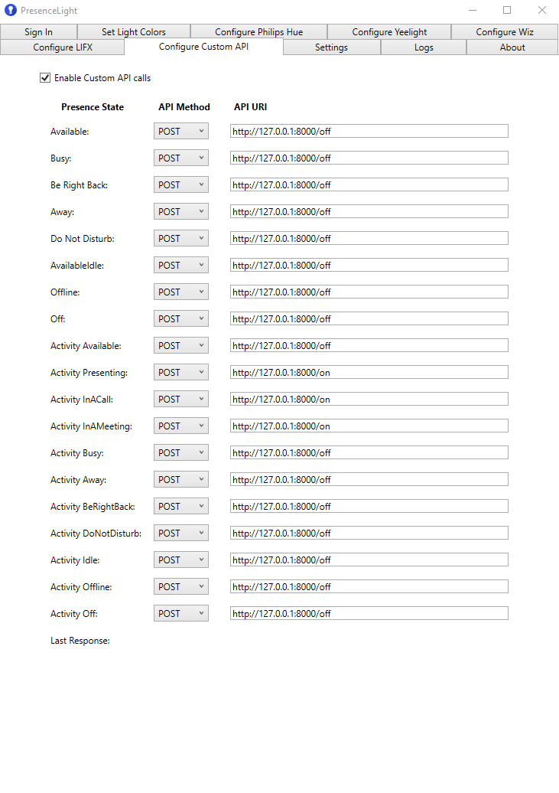

# Presence Light Home Assistant API Bridge

Creates a [FastAPI](https://github.com/tiangolo/fastapi) bridge to [Home Assistant](https://www.home-assistant.io/) for use with the simplified Custom API interface in [Presence Light](https://github.com/isaacrlevin/PresenceLight).

Fork from [https://github.com/loganjohnlong/presence-light-ha-api](https://github.com/loganjohnlong/presence-light-ha-api). Instead of changing the color of a light, this fork just turns an entity (for example a switch, but might also be a light) on or off.

## How to use

1. Get a [Long-lived Access Token](https://www.atomicha.com/home-assistant-how-to-generate-long-lived-access-token-part-1/) from your Home Assistant installation
2. Set the following environment variables in Docker:
    - HA_IP: The IP Address or FQDN of your Home Assistant installation that the Docker container will be able to access
    - HA_PORT: The port that your Home Assistant installation runs on (Normally, this is `8123`)
    - HA_ENTITY: The entity name of the light you want to use in the `<domain>.<name>` format. (I use `light.office_status_light` in mine.)
        - Note: This light must support RGB, or this application will fail
    - HA_TOKEN: The long-lived access token you generated earlier
    - HA_BRIGHTNESS: An integer between 0 and 100
3. Run the Docker container with the command `docker run -d --restart=unless-stopped -e "HA_IP=<your-ip>" -e "HA_PORT=<your-port>" -e "HA_ENTITY=<domain>.<name>" -e "HA_TOKEN=<your-token>" -e "HA_BRIGHTNESS=<your-brightness>" --name=presence-light-ha-api jeroenterheerdt/presence-light-ha-api`
4. Set the Custom API values in Presence Light. You should replace the IP and port seen below with the IP and port of this Docker container (not your Home Assistant installation). All calls in this application use POST.

## API Behavior

- `/off`: Turns the entity off
- `/on`: Turns the entity on
